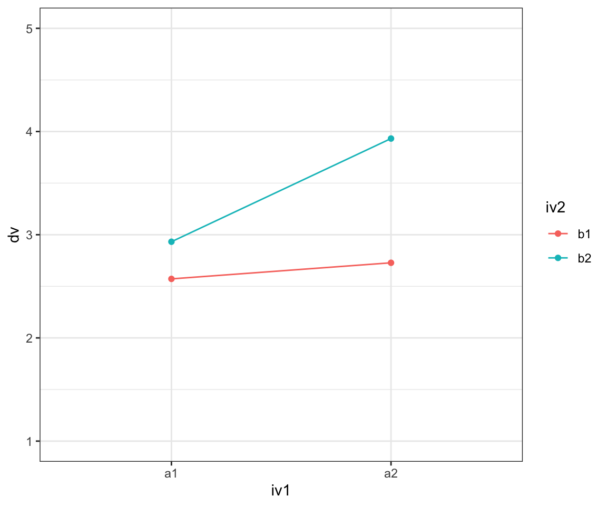

# Simulate power for 2x2 designs

1.  Make assumptions about the mean differences and standard deviations

2.  Simulate data (e.g., 1000 times)

3.  Extract p-values and count times the effect becomes significant

## Simulate data

First, we need to specify a function that simulates data that aligns
with our assumptions. Here is an example that simulates a 2x2
between-subject design.

    ## `summarise()` has grouped output by 'iv1'. You can override using the `.groups` argument.

## Prepare and run simulation

Next, we create a function that simulates the data, fits the models,
extracts p-values, significance (based on p &lt; .05), and the effect
size.

    ## $p_1
    ## [1] 6.080034e-06
    ## 
    ## $sig_1
    ## [1] TRUE
    ## 
    ## $p_2
    ## [1] 6.504763e-09
    ## 
    ## $sig_2
    ## [1] TRUE
    ## 
    ## $p_3
    ## [1] 0.006859086
    ## 
    ## $sig_3
    ## [1] TRUE
    ## 
    ## $es_1
    ## [1] 0.1866562
    ## 
    ## $es_2
    ## [1] 0.2407956
    ## 
    ## $es_3
    ## [1] 0.1111314

# Specify simulation parameters

Now, we create a list that how the parameters, in this cases the sample
size and the standard devations, should vary.

    ## $n
    ##  [1] 100 140 180 220 260 300 340 380 420 460 500 540 580 620 660 700 740 780 820
    ## [20] 860 900 940 980
    ## 
    ## $sd
    ## [1] 1.0 1.5 2.0

# Run simulation

Now, we can run the actual simulation. Here, we use 1.000 runs per
combination (this may take a bit)

    ##     n sd          p_1 sig_1          p_2 sig_2          p_3 sig_3      es_1
    ## 1 100  1 5.112261e-03     1 6.259447e-07     1 3.327282e-02     1 0.2893434
    ## 2 140  1 2.831864e-04     1 1.642343e-03     1 5.843402e-02     0 0.3171480
    ## 3 180  1 1.016670e-04     1 8.045243e-08     1 9.104531e-06     1 0.2980356
    ## 4 220  1 1.958832e-05     1 1.926542e-08     1 3.091118e-02     1 0.2956716
    ## 5 260  1 1.940382e-06     1 4.077271e-12     1 2.110937e-05     1 0.3032452
    ## 6 300  1 2.273831e-05     1 1.500109e-09     1 8.741741e-03     1 0.2493491
    ##        es_2      es_3
    ## 1 0.5385165 0.2204413
    ## 2 0.2733941 0.1636524
    ## 3 0.4196644 0.3445721
    ## 4 0.3952119 0.1478156
    ## 5 0.4531151 0.2708381
    ## 6 0.3614696 0.1534202

# Results

## Summary

We can now have a look at the results (e.g., by summarising the power or
effect sizes across the different specifications).

    ## # A tibble: 207 x 4
    ## # Groups:   n, sd [69]
    ##        n    sd key   power
    ##    <dbl> <dbl> <chr> <dbl>
    ##  1   100   1   sig_1   797
    ##  2   100   1   sig_2   981
    ##  3   100   1   sig_3   417
    ##  4   100   1.5 sig_1   483
    ##  5   100   1.5 sig_2   786
    ##  6   100   1.5 sig_3   222
    ##  7   100   2   sig_1   297
    ##  8   100   2   sig_2   574
    ##  9   100   2   sig_3   155
    ## 10   140   1   sig_1   920
    ## # … with 197 more rows
    ## # A tibble: 207 x 7
    ## # Groups:   n, sd [69]
    ##        n    sd key   cohens_f      se    ll    ul
    ##    <dbl> <dbl> <chr>    <dbl>   <dbl> <dbl> <dbl>
    ##  1   100   1   es_1     0.277 0.00298 0.271 0.283
    ##  2   100   1   es_2     0.408 0.00333 0.401 0.414
    ##  3   100   1   es_3     0.187 0.00310 0.181 0.193
    ##  4   100   1.5 es_1     0.200 0.00305 0.194 0.206
    ##  5   100   1.5 es_2     0.283 0.00326 0.276 0.289
    ##  6   100   1.5 es_3     0.136 0.00274 0.130 0.141
    ##  7   100   2   es_1     0.156 0.00294 0.150 0.162
    ##  8   100   2   es_2     0.220 0.00314 0.214 0.227
    ##  9   100   2   es_3     0.115 0.00252 0.110 0.120
    ## 10   140   1   es_1     0.277 0.00250 0.272 0.281
    ## # … with 197 more rows

## Plot power curves

Most importantly, we can plot so-called power curves that tell us how
much power we achieve (on average) for each specification. This helps to
decide for an appropriate sample size.

