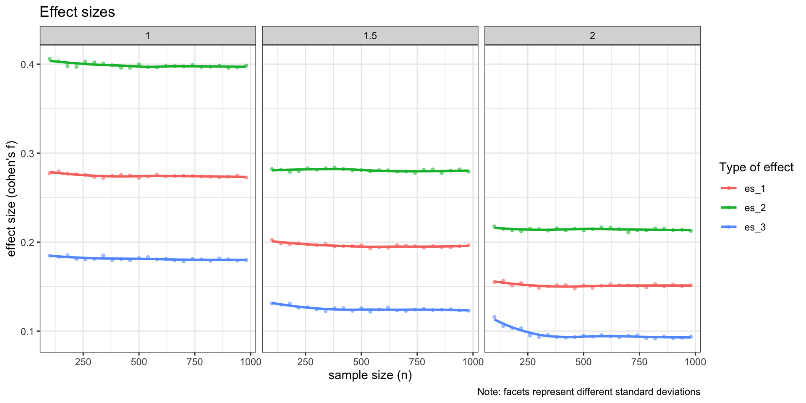

# Simulate power for 2x2 designs

``` r
library(tidyverse)
library(MonteCarlo)
library(effectsize)
```

1.  Make assumptions about the mean differences and standard deviations

2.  Simulate data (e.g., 1000 times)

3.  Extract p-values and count times the effect becomes significant

## Simulate data

First, we need to specify a function that simulates data that aligns
with our assumptions. Here is an example that simulates a 2x2
between-subject design.

``` r
# Function to simulate means 
sim_data <- function(n = 1000, 
                     means = c(2.5, 2.75,  # a1b1, a2b1
                               3,   4),   # a1b2, a2b2
                     sd = 1) {
  
  # simulate data
  dv <- rnorm(n, mean = means , sd = sd) %>% round(0)
  iv1 <- rep(c("a1", "a2"),each = 1, n/2)
  iv2 <- rep(c("b1", "b2"), each = 2, n/4)
  d <-data.frame(dv, iv1, iv2)
  return(d)
}

# Check data simulation
sim_data() %>%
  group_by(iv1, iv2) %>%
  summarise(m = mean(dv)) %>%
  ggplot(aes(x = factor(iv1), y = m, color = iv2, group = iv2)) +
  geom_point() +
  geom_line() +
  ylim(1, 5) +
  theme_bw() +
  labs(y = "dv", x = "iv1")
## `summarise()` has grouped output by 'iv1'. You can override using the `.groups` argument.
```


## Prepare and run simulation

Next, we create a function that simulates the data, fits the models,
extracts p-values, significance (based on p &lt; .05), and the effect
size.

``` r
# Simulation function
sim_func <- function(n = 600, 
                     means = c(2.5, 2.75,  
                               3,   4),
                     sd = 1.5) {
  
  # simulate data
  d <- sim_data(n = n, mean = means, sd = sd) # using the function from above
  
  # Fit models
  fit1 <- lm(dv ~ iv1, d)
  fit2 <- lm(dv ~ iv2, d)
  fit3 <- lm(dv ~ iv1*iv2, d)
  
  # extract p-values and compute significance
  p_1 <- summary(fit1)$coef[2,4]
  sig_1 <- ifelse(p_1 < .05, TRUE, FALSE)
  p_2 <- summary(fit2)$coef[2,4]
  sig_2 <- ifelse(p_2 < .05, TRUE, FALSE)
  p_3 <- summary(fit3)$coef[4,4]
  sig_3 <- ifelse(p_3 < .05, TRUE, FALSE)
  
  # extract effect size
  es_1 <- cohens_f(fit1, verbose = F) %>% 
    as.data.frame() %>%
    select(Cohens_f) %>%
    as.numeric
  es_2 <- cohens_f(fit2, verbose = F) %>% 
    as.data.frame() %>%
    select(Cohens_f) %>%
    as.numeric
  es_3 <- cohens_f(fit3, verbose = F) %>% 
    as.data.frame() %>%
    filter(Parameter == "iv1:iv2") %>%
    select(Cohens_f_partial) %>%
    as.numeric


  # return values as list
  return(list("p_1" = p_1,
              "sig_1" = sig_1,
              "p_2" = p_2,
              "sig_2" = sig_2,
              "p_3" = p_3,
              "sig_3" = sig_3,
              "es_1" = es_1,
              "es_2" = es_2,
              "es_3" = es_3))
}

# check
sim_func()
## $p_1
## [1] 3.164735e-07
## 
## $sig_1
## [1] TRUE
## 
## $p_2
## [1] 1.8038e-07
## 
## $sig_2
## [1] TRUE
## 
## $p_3
## [1] 2.087298e-05
## 
## $sig_3
## [1] TRUE
## 
## $es_1
## [1] 0.2114976
## 
## $es_2
## [1] 0.215945
## 
## $es_3
## [1] 0.1757126
```

# Specify simulation parameters

Now, we create a list that how the parameters, in this cases the sample
size and the standard devations, should vary.

``` r
n_grid <- seq(100, 1000, 40) 
sd_grid <- c(1, 1.5, 2) 

# Collect simulation parameters in list
(param_list <- list("n" = n_grid,
                    "sd" = sd_grid))
## $n
##  [1] 100 140 180 220 260 300 340 380 420 460 500 540 580 620 660 700 740 780 820
## [20] 860 900 940 980
## 
## $sd
## [1] 1.0 1.5 2.0
```

# Run simulation

Now, we can run the actual simulation. Here, we use 1.000 runs per
combination (this may take a bit)

``` r
result <- MonteCarlo(func = sim_func,             # pass test function
                     nrep = 1000,                 # number of tests
                     ncpus = 1,                   # number of cores to be used
                     param_list = param_list)     # provide parameters
```

``` r
# Create result data frame
df <- MakeFrame(result)
head(df)
##     n sd          p_1 sig_1          p_2 sig_2          p_3 sig_3      es_1
## 1 100  1 1.326314e-04     1 2.861469e-03     1 0.0014183037     1 0.4019587
## 2 140  1 1.403719e-01     0 8.697630e-04     1 0.0596479815     0 0.1262358
## 3 180  1 4.263011e-05     1 8.523920e-07     1 0.0076651907     1 0.3145835
## 4 220  1 1.649992e-06     1 4.686557e-09     1 0.0110495102     1 0.3337034
## 5 260  1 1.930350e-05     1 1.046554e-08     1 0.1868721878     0 0.2710592
## 6 300  1 4.634732e-09     1 5.495895e-13     1 0.0006552488     1 0.3497727
##        es_2       es_3
## 1 0.3090350 0.33541020
## 2 0.2897638 0.16286023
## 3 0.3824838 0.20333354
## 4 0.4133922 0.17440651
## 5 0.3682874 0.08271455
## 6 0.4371129 0.20019592
```

# Results

## Summary

We can now have a look at the results (e.g., by summarising the power or
effect sizes across the different specifications).

``` r
# Power in each combination
df %>%
  select(-contains("p"), -contains("es")) %>%
  gather(key, value, -n, -sd) %>%
  group_by(n, sd, key) %>%
  summarize(power = sum(value))
## # A tibble: 207 x 4
## # Groups:   n, sd [69]
##        n    sd key   power
##    <dbl> <dbl> <chr> <dbl>
##  1   100   1   sig_1   797
##  2   100   1   sig_2   986
##  3   100   1   sig_3   412
##  4   100   1.5 sig_1   508
##  5   100   1.5 sig_2   785
##  6   100   1.5 sig_3   196
##  7   100   2   sig_1   306
##  8   100   2   sig_2   552
##  9   100   2   sig_3   159
## 10   140   1   sig_1   924
## # … with 197 more rows

# Average effect size in each combination
(es <- df %>%
  select(-contains("p"), -contains("sig")) %>%
  gather(key, value, -n, -sd) %>%
  group_by(n, sd, key) %>%
  summarize(cohens_f = mean(value),
            se = psych::describe(value)$se,
            ll = cohens_f - 1.96*se,
            ul = cohens_f + 1.96*se))
## # A tibble: 207 x 7
## # Groups:   n, sd [69]
##        n    sd key   cohens_f      se    ll    ul
##    <dbl> <dbl> <chr>    <dbl>   <dbl> <dbl> <dbl>
##  1   100   1   es_1     0.277 0.00290 0.271 0.283
##  2   100   1   es_2     0.406 0.00317 0.400 0.412
##  3   100   1   es_3     0.185 0.00305 0.179 0.191
##  4   100   1.5 es_1     0.203 0.00298 0.197 0.208
##  5   100   1.5 es_2     0.282 0.00323 0.276 0.288
##  6   100   1.5 es_3     0.131 0.00284 0.126 0.137
##  7   100   2   es_1     0.155 0.00282 0.150 0.161
##  8   100   2   es_2     0.218 0.00328 0.211 0.224
##  9   100   2   es_3     0.116 0.00263 0.111 0.121
## 10   140   1   es_1     0.280 0.00250 0.275 0.285
## # … with 197 more rows

# Plot effect sizes
es %>%
  ggplot(aes(x = n, y = cohens_f, color = key)) +
  geom_point(alpha = .5, size = 1) +
  geom_smooth(se = F) +
  facet_wrap(~sd, ncol = 3) +
  theme_bw() +
  labs(title = "Effect sizes",
       x = "sample size (n)",
       y = "effect size (cohen's f)",
       color = "Type of effect",
       caption = "Note: facets represent different standard deviations")
```



## Plot power curves

Most importantly, we can plot so-called power curves that tell us how
much power we achieve (on average) for each specification. This helps to
decide for an appropriate sample size.

``` r
df %>%
  select(-contains("p"), -contains("es")) %>%
  gather(key, value, -n, -sd) %>%
  group_by(n, sd, key) %>%
  summarize(power = sum(value)/10) %>%
  ggplot(aes(x = n, y = power, color = key)) +
  geom_smooth(se = F) +
  geom_point() +
  geom_hline(yintercept = 80, linetype = "dashed") +
  geom_hline(yintercept = 95, linetype = "dashed") +
  facet_wrap(~sd) +
  theme_bw() +
  labs(title = "Power Curves",
       x = "sample size (n)", 
       y = "power (1-beta)", 
       color = "type of effect",
       caption = "Note: facets represent different standard deviations")
```


